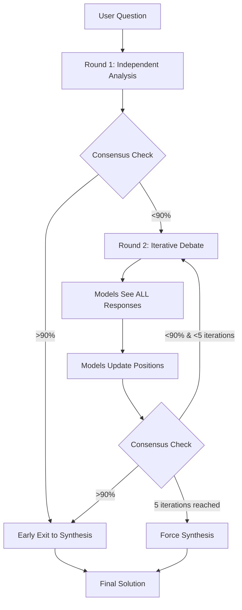

# Iterative Debate System Architecture

## Overview

The Iterative Debate System implements a true multi-agent consensus-building process where AI models engage in structured debate until they reach agreement or exhaust iteration limits.

## Key Improvements Over Linear Debate

### Previous System (Linear)
- Round 1: All models give independent answers
- Best answer selected by keyword scoring
- Round 2: Other models see only the best answer
- Single improvement round
- Final synthesis

### New System (Iterative)
- Round 1: All models give independent answers
- **Consensus evaluation** after each round
- **Early exit** if high consensus (e.g., "Vilnius is Lithuania's capital")
- Round 2+: **All models see ALL responses** from others
- **Iterative refinement** - up to 5 rounds
- Models can update positions based on arguments
- **Coordinator monitors consensus evolution**
- Final synthesis only after consensus or max iterations

## Architecture Components

### 1. IterativeDebateOrchestrator
Main orchestrator that manages the entire debate process.

**Key Features:**
- Configurable max iterations (default: 5)
- Configurable consensus threshold (default: 90%)
- Early exit on high consensus
- Stuck detection (no progress after 3 rounds)

### 2. ConsensusAnalyzer
Evaluates agreement level between model responses using LLM understanding.

**Consensus Scoring:**
- 90-100%: Strong consensus, ready for synthesis
- 70-89%: Moderate consensus, minor disagreements
- 50-69%: Weak consensus, significant disagreements
- 0-49%: No consensus, fundamental disagreements

**Features:**
- Dynamic evaluation based on question type
- Identifies specific disagreements
- Tracks convergence trend (improving/stable/diverging)
- Fallback mechanism if LLM evaluation fails

### 3. DebateMemory
Tracks the evolution of the debate across iterations.

**Stores:**
- All responses from each iteration
- Consensus scores over time
- Model position changes
- Convergence metrics
- Key disagreements per round

## Process Flow



## Iteration Dynamics

### Each Iteration Contains:
1. **Full Visibility**: Each model sees all other models' current positions
2. **Position Update**: Models can:
   - Maintain position with additional justification
   - Partially agree and modify stance
   - Fully adopt different position if convinced
3. **Consensus Evaluation**: Coordinator evaluates agreement level
4. **Decision Point**: Continue iteration or proceed to synthesis

### Example Scenarios

#### Factual Question (Early Exit)
**Question**: "What is the capital of Lithuania?"
- Round 1: All models answer "Vilnius" with slight variations
- Consensus: 98%
- Result: **Early exit**, no iteration needed
- Total time: ~30 seconds

#### Complex Question (Full Iteration)
**Question**: "Best microservices architecture for a startup?"
- Round 1: Different approaches (monolith-first, full microservices, hybrid)
- Consensus: 45%
- Round 2: Models see disagreements, some converge on hybrid
- Consensus: 72%
- Round 3: Further refinement, agreement on staged approach
- Consensus: 91%
- Result: **Consensus reached** after 3 iterations

#### Philosophical Question (Max Iterations)
**Question**: "Is AGI consciousness possible?"
- Rounds 1-5: Fundamental philosophical disagreements persist
- Consensus evolution: 35% → 42% → 48% → 51% → 53%
- Result: **Max iterations**, coordinator synthesizes best arguments

## Implementation Details

### Model Communication Protocol
Each model receives:
```json
{
  "original_question": "...",
  "your_previous_response": "...",
  "other_models_positions": {
    "Model A": "response...",
    "Model B": "response...",
    "Model C": "response..."
  },
  "consensus_status": {
    "current_score": 72,
    "trend": [45, 62, 72],
    "key_disagreements": ["..."]
  },
  "iteration": 3
}
```

### Consensus Evaluation Prompt
The coordinator evaluates responses by:
1. Identifying core agreement points
2. Listing significant disagreements
3. Calculating consensus score
4. Determining if debate should continue
5. Assessing convergence trend

### MCP Integration
Available as `iterative_debate` tool with parameters:
- `question` (required): The problem to analyze
- `projectPath` (optional): Project context
- `maxIterations` (optional): Override max iterations
- `consensusThreshold` (optional): Override consensus threshold

## Benefits

1. **Efficiency**: Early exit for obvious consensus saves time
2. **Depth**: Complex topics get thorough multi-round analysis
3. **Transparency**: Full debate history shows evolution of thought
4. **Quality**: Models learn from each other's arguments
5. **Flexibility**: Configurable thresholds for different use cases
6. **Intelligence**: LLM-based consensus evaluation understands semantic agreement

## Usage Examples

### Simple Factual Query
```javascript
mcp.iterative_debate({
  question: "What is 2+2?"
})
// Result: Immediate consensus (100%), one round
```

### Complex Technical Decision
```javascript
mcp.iterative_debate({
  question: "Should we use Kubernetes for our 5-person startup?",
  maxIterations: 7,
  consensusThreshold: 85
})
// Result: Nuanced discussion, consensus after 4 rounds
```

### Exploratory Research
```javascript
mcp.iterative_debate({
  question: "How might quantum computing affect cryptography?",
  consensusThreshold: 70  // Lower threshold for exploratory topics
})
// Result: Rich discussion, partial consensus on key impacts
```

## Future Enhancements

1. **Weighted Voting**: Give more weight to domain experts
2. **Dynamic Participants**: Add/remove models based on topic
3. **Debate Strategies**: Different debate styles (adversarial, collaborative)
4. **Consensus Metrics**: Multiple consensus dimensions (facts, approach, priority)
5. **Learning**: System learns optimal thresholds per topic category
6. **Parallel Debates**: Run multiple debate threads for complex multi-part questions

## Conclusion

The Iterative Debate System transforms simple Q&A into intelligent multi-agent collaboration, achieving better answers through structured consensus-building while remaining efficient through early exit strategies.