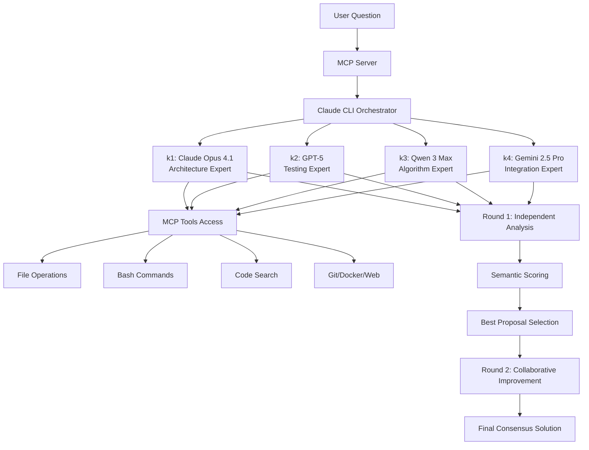

# MCP Debate Consensus Server

**A revolutionary approach to AI problem-solving through multi-model consensus using Claude CLI with full MCP tool access.**

## 🎯 Why This Matters

Traditional single-model AI approaches have inherent limitations - biases, knowledge gaps, and singular perspectives. This MCP server solves these issues by orchestrating multiple state-of-the-art LLMs in structured debates, where each model brings unique expertise and has **full access to development tools** through Claude CLI integration.

### Key Differentiators

- **🧠 True Multi-Model Intelligence**: Not just API calls, but actual Claude CLI instances with complete MCP tool access
- **🔧 Full Development Capabilities**: Each model can read files, execute commands, search codebases, run tests, and more
- **🎓 Specialized Expertise**: Each model focuses on their strengths (architecture, testing, algorithms, integration)
- **🤝 Consensus Building**: Structured debate process ensures thorough analysis and balanced solutions
- **🔍 Semantic Scoring**: Advanced algorithm evaluates proposals on relevance, novelty, quality, and coherence

## 🚀 Quick Start

```bash
# 1. Clone & install
git clone https://github.com/KostasNoreika/mcp-debate-consensus.git
cd mcp-debate-consensus && npm install

# 2. Run automated setup
node install.js

# 3. Start the proxy server (required)
node k-proxy-server.js

# 4. Run health check
node health-check.js

# 5. Test the system
node test-debate.js "What's the best architecture for a real-time chat app?"
```

## 🏗️ Architecture

### How It Works



### Core Components

1. **MCP Server (`index.js`)**
   - Implements Model Context Protocol specification
   - Handles tool registration and request routing
   - Manages security and rate limiting

2. **Claude CLI Orchestrator (`src/claude-cli-debate.js`)**
   - Spawns actual Claude CLI processes for each model
   - Manages inter-model communication
   - Coordinates debate rounds and synthesis

3. **Proxy Server (`k-proxy-server.js`)**
   - Routes k1-k4 aliases to different models via OpenRouter
   - Enables model diversity while using Claude CLI interface
   - Handles API authentication and request forwarding

4. **Security Layer (`src/security.js`)**
   - Input validation and sanitization
   - API key protection
   - Rate limiting
   - Path traversal prevention

## 💡 Real-World Benefits

### For Development Teams

- **Better Architecture Decisions**: Multiple expert perspectives ensure robust system design
- **Comprehensive Testing**: Testing expert (k2) ensures quality and coverage
- **Optimized Algorithms**: Algorithm specialist (k3) identifies performance improvements
- **Seamless Integration**: Integration expert (k4) ensures compatibility

### For Complex Problems

- **Reduced Bias**: Multiple models counteract individual model biases
- **Higher Accuracy**: Consensus approach reduces errors
- **Complete Solutions**: Each model can explore the actual codebase
- **Practical Implementation**: Models provide working code, not just theory

### Example Use Cases

1. **System Architecture Design**
   ```bash
   node test-debate.js "Design a scalable microservices architecture for an e-commerce platform"
   ```

2. **Code Review and Optimization**
   ```bash
   node test-debate.js "Review and optimize the performance of our React application"
   ```

3. **Security Analysis**
   ```bash
   node test-debate.js "Analyze security vulnerabilities in our authentication system"
   ```

4. **Technology Selection**
   ```bash
   node test-debate.js "Choose the best database for our real-time analytics platform"
   ```

## 🛠️ Installation

### Prerequisites

- Node.js 18+ 
- npm or yarn
- OpenRouter API key from [OpenRouter](https://openrouter.ai/keys)

### Automated Setup

```bash
# Run the interactive installer
node install.js
```

The installer will:
- ✅ Check system requirements
- ✅ Install dependencies
- ✅ Configure environment
- ✅ Set up Claude CLI paths
- ✅ Create configuration directories
- ✅ Test API connection
- ✅ Verify proxy servers

### Manual Setup

<details>
<summary>Click for manual setup instructions</summary>

1. **Install dependencies:**
   ```bash
   npm install
   cd claude-router && npm install && cd ..
   ```

2. **Configure API key (required locally):**
   ```bash
   cp .env.example .env
   # Edit .env and add your OpenRouter API key
   # This file is git-ignored for security
   ```

3. **Install Claude CLI (optional but recommended):**
   ```bash
   npm install -g @anthropic/claude-cli
   ```

4. **Start proxy server:**
   ```bash
   node k-proxy-server.js
   ```

5. **Run health check:**
   ```bash
   node health-check.js
   ```

</details>

## 🔧 Configuration

### Environment Variables

Create a `.env` file with:

```env
OPENROUTER_API_KEY=your_api_key_here
PROXY_PORT=3456              # Optional: base port for proxy servers
DEBATE_TIMEOUT=1800000        # Optional: max debate time (30 min default)
MIN_MODELS_REQUIRED=2         # Optional: minimum models for consensus
```

### MCP Integration

Add to your `~/.claude.json`:

```json
{
  "mcpServers": {
    "debate-consensus": {
      "command": "node",
      "args": ["/path/to/mcp-debate-consensus/index.js"],
      "env": {
        "OPENROUTER_API_KEY": "your-api-key"
      }
    }
  }
}
```

## 📊 How Scoring Works

The semantic scoring algorithm evaluates each proposal:

- **Relevance (40%)**: How well the answer addresses the question
- **Novelty (20%)**: Unique insights and creative approaches  
- **Quality (20%)**: Technical accuracy and completeness
- **Coherence (20%)**: Logical structure and clarity

## 🧪 Testing

```bash
# Run health check
node health-check.js

# Test basic functionality
npm test

# Test debate with custom question
node test-debate.js "Your question here"

# Run comprehensive test suite
npm run test:all
```

## 🔒 Security Features

- **Input Validation**: All inputs sanitized and validated
- **API Key Protection**: Keys never exposed in logs or outputs
- **Rate Limiting**: Prevents abuse and excessive API usage
- **Path Restrictions**: Prevents access to system directories
- **Secure Communication**: All model communication encrypted

## 🚦 Health Monitoring

The built-in health check verifies:

- ✅ Node.js version compatibility
- ✅ All dependencies installed
- ✅ Environment properly configured
- ✅ Proxy servers running
- ✅ Claude CLI available
- ✅ API connection working

Run: `node health-check.js`

## 📈 Performance

- **Parallel Processing**: Models analyze independently in Round 1
- **Efficient Caching**: Responses cached to reduce API calls
- **Timeout Management**: Configurable timeouts prevent hanging
- **Resource Optimization**: Automatic cleanup of old logs

## 🤝 Contributing

We welcome contributions! Please see [CONTRIBUTING.md](CONTRIBUTING.md) for guidelines.

### Development Setup

```bash
# Clone the repository
git clone https://github.com/KostasNoreika/mcp-debate-consensus.git

# Create feature branch
git checkout -b feature/your-feature

# Install dev dependencies
npm install --include=dev

# Run tests
npm test

# Submit PR
```

## 📄 License

MIT License - see [LICENSE](LICENSE) file for details.

## 🙏 Acknowledgments

- Built on [Model Context Protocol (MCP)](https://github.com/anthropics/mcp) by Anthropic
- Powered by [OpenRouter](https://openrouter.ai) for unified model access
- Inspired by ensemble learning and wisdom of crowds principles

## 📞 Support

- **Issues**: [GitHub Issues](https://github.com/KostasNoreika/mcp-debate-consensus/issues)
- **Discussions**: [GitHub Discussions](https://github.com/KostasNoreika/mcp-debate-consensus/discussions)
- **Documentation**: [Wiki](https://github.com/KostasNoreika/mcp-debate-consensus/wiki)

## 🚀 Roadmap

- [ ] Web UI for easier interaction
- [ ] Support for more models
- [ ] Custom expertise configuration
- [ ] Debate history analytics
- [ ] Plugin system for extensions
- [ ] Cloud deployment options

---

**⭐ If you find this project useful, please star it on GitHub!**